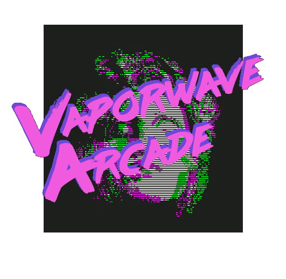
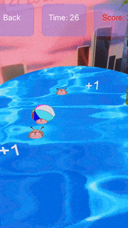
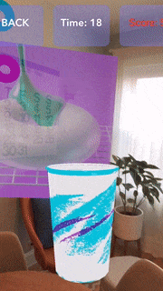

# Vaporwave Arcade

Vaporwave Arcade is a mobile app that features augmented reality technology to create three mini-games with leaderboards. These games feature a Vaporwave theme and offer an immersive and engaging experience for the player.

Primary technologies used: ReactNative, ViroReact, Firebase

## Setup 
Currently the only way to use the application is through ViroMedia's test bed app for quickly testing apps that use their AR framework. Follow the following steps to setup and run the games on your own phone:

1. Clone the github repo
2. Download the Viro Media application from the Apple Store on iOS or the Google Play store on Android (it's free)
3. Type 'npm install' in the terminal while in the repo's directory
4. Type 'npm run start' in the terminal while in the repo's directory
5. After a few seconds the terminal will display an ngrok link, enter this in the Viro Media app. Alternatively you may enter your ip address in the app.
6. You're ready to play!

## Demo GIFs

### Dependencies

"assert-plus": "^1.0.0",  
"firebase": "^6.0.1",  
"ngrok": "^3.1.1",  
"react": "16.8.3",  
"react-native": "^0.59.8",  
"react-native-leaderboard": "^1.0.5",  
"react-native-linear-gradient": "^2.5.4",  
"react-native-loading-spinner-overlay": "^1.0.1",  
"react-native-really-awesome-button": "^1.4.2",  
"react-timer-mixin": "^0.13.4",  
"react-viro": "2.14.0"  

## Presentation Video

https://www.youtube.com/watch?v=VgmwTsbKUtw  

## Team

* 1902Capstone

Contributors:

Thomas Pollick: [tpol47](https://github.com/tpol47)

Armon Davani: [armondavani](https://github.com/armondavani)

Loren Vanderbilt (fka Josh): [LorenVanderbilt](https://github.com/LorenVanderbilt)

Michael Chang: [mchang22](https://github.com/mchang22)

## Copyright and attribution

Copyright (c) 2016 DataMade. Released under the MIT License.
